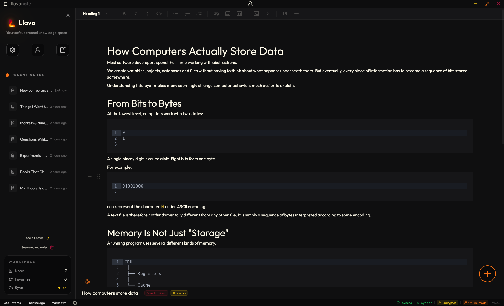
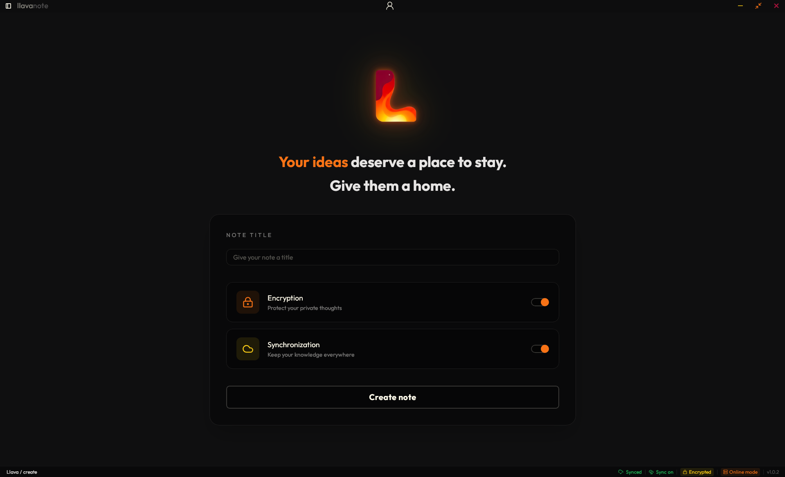

<a id="readme-top"></a>

[![LinkedIn][linkedin-shield]][linkedin-url]

<br />

<div align="center">

<a href="https://github.com/AntekKowalcze/llava-notebook/releases/latest">
  
</a>

<h3 align="center">Llava</h3>

<p align="center">
  Secure, offline-first desktop personal knowledge management application
  <br />
  with end-to-end encryption and multi-device synchronization.
  <br /><br />

<a href="https://github.com/AntekKowalcze/llava-notebook/issues">Report Bug</a> | <a href="https://github.com/AntekKowalcze/llava-notebook/releases">Releases</a>

</p>

</div>

<br />

<details>
  <summary>Table of Contents</summary>

  <ol>
    <li>
      <a href="#about-the-project">About The Project</a>
      <ul>
        <li><a href="#built-with">Built With</a></li>
        <li><a href="#features">Features</a></li>
        <li><a href="#demo">Demo</a></li>
      </ul>
    </li>
    <li>
      <a href="#getting-started">Getting Started</a>
      <ul>
        <li><a href="#prerequisites">Prerequisites</a></li>
        <li><a href="#installation">Installation</a></li>
      </ul>
    </li>
    <li><a href="#usage">Usage</a></li>
    <li><a href="#architecture">Architecture</a></li>
    <li><a href="#roadmap">Roadmap</a></li>
    <li><a href="#license">License</a></li>
    <li><a href="#contact">Contact</a></li>
  </ol>
</details>

---

## About The Project

Llava is a secure, offline-first personal knowledge management application designed around local data ownership, end-to-end encryption, and reliable synchronization across devices.

The application is built as a cross-platform desktop client using **Tauri 2**, with a **Rust** application core and **Vue 3** frontend. Local data is stored in **SQLite**, while an optional **Go** backend provides synchronization with **MongoDB** and **Amazon S3**.

Llava was built from scratch to explore how the individual parts of a larger software system work together.

The project focuses on:

* Offline-first operation
* End-to-end encryption
* Secure authentication
* Local-first data storage
* Multi-device synchronization
* Encrypted attachments
* Cross-platform desktop development

Rather than building a small application around a limited feature set, I used Llava as an opportunity to work with technologies and concepts that were new to me, including Rust, Tauri, Vue, SQLite, Go, MongoDB, Amazon S3, authentication, encryption, and multi-device synchronization.

As the project grew, features such as encrypted storage, offline operation, synchronization, attachment handling, authentication, and recovery mechanisms became practical problems to solve rather than isolated technologies to learn.

The result is a project that is both a functional application and a learning experience focused on understanding how a complete system can be designed and built from the ground up. You can look at first version of this application in archive_prototype folder.



<p align="right">(<a href="#readme-top">back to top</a>)</p>

### Built With

[![Rust][Rust]][Rust-url]
[![Tauri][Tauri]][Tauri-url]
[![Vue.js][Vue.js]][Vue-url]
[![Tailwind CSS][Tailwind CSS]][Tailwind-url]
[![SQLite][SQLite]][SQLite-url]
[![Go][Go]][Go-url]
[![MongoDB][MongoDB]][MongoDB-url]
[![Amazon S3][Amazon S3]][Amazon-S3-url]

<p align="right">(<a href="#readme-top">back to top</a>)</p>

### Features

* **Offline-first** - notes can be created, edited, and managed without an internet connection.
* **End-to-end encryption** - sensitive data is encrypted locally before synchronization.
* **Multi-device synchronization** - notes and attachments can be synchronized across devices.
* **Local SQLite storage** - application data remains available locally for fast access and offline operation.
* **Encrypted attachments** - attachments are encrypted before being uploaded to cloud storage.
* **Secure authentication** - local and online authentication use dedicated password, session, and token security mechanisms.
* **Recovery codes** - recovery mechanisms provide additional ways to regain access to encrypted data.
* **Automatic synchronization** - local changes are synchronized when online synchronization is enabled.
* **Cross-platform desktop application** - built with Tauri for Windows, Linux, and macOS.
* **AI features** - disabled by default; when enabled, users can use an LLM to work with their notes.
<p align="right">(<a href="#readme-top">back to top</a>)</p>

### Demo

[](https://github.com/user-attachments/assets/23f1b340-dab6-46b2-9602-7c9dccbb9ccf)


The demo shows Llava running simultaneously on a **Windows client** and a **Linux client**, demonstrating the local-first synchronization model while both devices interact with the same account.

It covers:

* Creating notes with per-note encryption and synchronization toggles
* Editing notes with rich Markdown formatting
* AI-assisted content generation directly inside the editor
* Attaching files and adding links
* Synchronizing newly created and edited notes across devices
* Continuing to work locally while offline
* Connection-state feedback during network interruptions
* Automatic reconnection and synchronization after connectivity is restored
* Synchronizing file attachments across devices
* Synchronizing note deletions
* Per-note management options such as favorites, tags, renaming, encryption, and synchronization
* Account and synchronization settings, including registration, connection, disconnection, and searchable settings

<p align="right">(<a href="#readme-top">back to top</a>)</p>

---

## Getting Started

### Prerequisites

The following tools are required to build Llava from source:

* Node.js
* npm
* Rust
* Cargo
* Tauri CLI
* Go
* A Linux keyring service when building on Linux

### Installation

Clone the repository:

```sh
git clone https://github.com/AntekKowalcze/llava-notebook.git
cd llava-notebook
```

The desktop application lives in `desktop/`:

```sh
cd desktop
npm install
```

For release and build configuration, see `release.yml`.

Start the development build:

```sh
npm run tauri dev
```

Build the application:

```sh
npm run tauri build
```

<p align="right">(<a href="#readme-top">back to top</a>)</p>

---

## Usage

A typical workflow consists of:

1. Creating a local account
2. Logging into the application
3. Creating and editing notes
4. Enabling online synchronization
5. Connecting the same account on another device
6. Synchronizing notes and attachments
7. Continuing to work offline
8. Reconnecting and synchronizing local changes
9. Using the application on multiple devices simultaneously

<p align="right">(<a href="#readme-top">back to top</a>)</p>

---

## Architecture

Llava consists of a cross-platform desktop application and an optional cloud synchronization backend.

### Desktop Application

The desktop application is built with:

* **Tauri 2** - desktop application framework
* **Rust** - application core, authentication, encryption, local storage, and synchronization logic
* **Vue 3** - user interface
* **Tailwind CSS** - UI styling
* **SQLite** - local database
* **Milkdown / Crepe** - Markdown editor

The application follows an offline-first architecture, so local operations do not depend on network availability.

### Backend

The synchronization backend is implemented in Go using Fiber.

It is responsible for:

* Authentication
* Synchronization
* Note storage
* Attachment coordination
* Quota management
* Communication with MongoDB
* Communication with Amazon S3

MongoDB stores synchronized note data and metadata.

Attachments are stored separately in Amazon S3 rather than MongoDB.

### Storage

```text
┌──────────────────────────────────────┐
│         Desktop Application          │
│                                      │
│  Vue 3                               │
│    │                                 │
│  Tauri 2                             │
│    │                                 │
│  Rust Core                           │
│    │                                 │
│  SQLite + Local Encrypted Data       │
└──────────────────┬───────────────────┘
                   │
            Synchronization
                   │
                   ▼
┌──────────────────────────────────────┐
│            Go Backend                │
│               Fiber                  │
└───────────────┬──────────────┬───────┘
                │              │
                ▼              ▼
         ┌──────────┐   ┌──────────┐
         │ MongoDB  │   │ Amazon S3│
         │ Notes +  │   │ Attach.  │
         │ Metadata │   │          │
         └──────────┘   └──────────┘
```

### Encryption

Llava uses end-to-end encryption so that sensitive user data is encrypted on the client before being synchronized.

The cryptographic architecture includes:

* **Argon2id** for password-based key derivation
* **ChaCha20-Poly1305** for authenticated encryption
* Local management of encryption keys
* Recovery codes for recovering access to encrypted data
* No server-side access to the user's plaintext encryption keys

### Key hierarchy

Llava uses a single symmetric data-encryption key (`notes_key`, ChaCha20-Poly1305, 256-bit) per user.

This key is never derived directly from a password. It is generated once as random data and then **wrapped** (encrypted) under several independent key-encryption keys (KEKs), allowing different credentials to unlock the same underlying data.

**The DEK**

* `notes_key` is generated once at account creation.
* It is used to encrypt note content, note titles, and file attachments.
* Each encrypted field receives its own random 96-bit nonce stored alongside its ciphertext.
* There is no per-note or per-attachment key; one DEK protects the user's data.

**Wrapping paths**

| Path                          | KDF                                                            | Storage                                                                   |
| ----------------------------- | -------------------------------------------------------------- | ------------------------------------------------------------------------- |
| Local password                | Argon2id using password and `kek_salt`                         | `users_data.notes_key` / `nonce_notes_key`                                |
| Recovery codes                | Argon2id with a unique salt per code                           | `recovery_keys.wrapped_notes_key`                                         |
| Local session ("remember me") | SHA-256 of a random session token                              | `session_data.wrapped_notes_key`; raw token stored only in the OS keyring |
| Online account                | Server-issued master key, wrapped using a password-derived KEK | Encrypted master key returned to the client and re-wrapped locally        |

**Online login / cross-device synchronization**

1. The client requests a login salt from the server, derives a password hash locally, and submits that derived value for authentication.
2. The server protects the stored verifier with a secret server-side HMAC pepper.
3. After successful authentication, the server returns an encrypted master key together with its independent `kek_salt` and Argon2 parameters.
4. The client derives the online KEK and decrypts the master key locally.
5. If the online key differs from the device's current local `notes_key`, the locally encrypted notes and attachments are re-encrypted under the online key and the local key wrappers are updated.

This allows devices connected to the same online account to converge on the same underlying encryption key without exposing that key to the server.

**Design properties**

* Every encryption and key-wrapping operation uses a fresh random nonce.
* Sensitive buffers such as passwords, derived KEKs, and decrypted keys are zeroized after use.
* Losing one credential does not necessarily result in data loss as long as another valid wrapped copy remains available.

### Authentication

Llava supports both local and online authentication. The server never receives a plaintext password or the actual notes-encryption key.

**Local authentication**

Accounts live entirely on-device in a local SQLite database.

A user registers with a username and password. The password is hashed with Argon2id and stored as a PHC string, with constant-time verification during login.

Registration also issues **eight recovery codes**. Each code is independently processed with Argon2id and can wrap its own copy of the notes-encryption key under a KEK derived from that code.

Repeated failed password attempts trigger a progressive lockout, with the timeout increasing after every fifth failure.

**Sessions**

A successful login creates a session by generating a random UUIDv4 token.

The SHA-256 hash of the token is stored in the `session_data` table, while the raw token is stored only in the operating system's secure keyring:

* Keychain on macOS
* Credential Manager on Windows
* Secret Service on Linux

Restoring a session requires both the stored database record and the corresponding token from the OS keyring, so a stolen SQLite database alone cannot recreate an active session.

Sessions also carry an expiry and are removed on logout or timeout.

**Online authentication**

The client never sends the raw password over the network.

During registration, the client derives an Argon2id password hash locally and sends that derived value to the server together with a client-generated salt. The server then applies an HMAC-SHA256 keyed with a secret server-side pepper and stores only the resulting verifier.

The pepper protects the stored verifier if the authentication database is compromised and prevents the stored verifier from directly revealing the server-side verification secret.

Login uses a separate pre-login request to retrieve the appropriate salt. For unknown email addresses, the server returns a cryptographically random dummy salt, reducing the usefulness of the endpoint for account enumeration.

After successful authentication, the server returns the encrypted master key together with its independent KEK salt and Argon2 parameters, which the client uses to decrypt the online encryption key locally.

**Sessions & tokens (server side)**

Successful online authentication issues:

* A short-lived JWT access token
* A refresh token containing a random identifier and HMAC-derived signature

Refresh tokens are stored server-side as:

```text
{ jti, device_id, user_id, token_hash }
```

Refresh tokens are bound to the authenticated user and device and rotated on every successful refresh. The consumed token is deleted before the replacement token is stored, preventing reuse of the old token.

Refresh tokens expire after 30 days.

Logging out removes refresh tokens for the current device, while logging out everywhere removes all refresh tokens associated with the account.

Failed login attempts are also tracked server-side independently of the client's local lockout mechanism. Every fifth consecutive failure triggers a 30-second lockout, while successful authentication resets the failure counter.

### Synchronization

Synchronization is driven by a `SyncCheck` request.

The client sends its local notes together with their `cloud_id` and `cloud_version` state. The backend compares each note with its cloud counterpart using optimistic concurrency on `cloud_version`.

The server processes notes concurrently using one goroutine per note through `errgroup`, while MongoDB and S3 operations are limited by a bounded worker pool.

Each note can result in:

* Uploading local changes
* Downloading cloud changes
* Remaining synchronized

Hard deletes are never applied immediately.

A deletion is first represented as a tombstone and protected by the same optimistic version check, preventing stale or concurrent operations from silently overwriting newer state.

Only after the tombstone is committed are the note's S3 attachments removed.

Attachments are checked concurrently by comparing encrypted checksums against S3 object metadata. Actual file bytes do not pass through the application server; uploads and downloads use presigned S3 URLs.

Attachment uploads are additionally protected by per-user storage quotas. Capacity is reserved before a presigned upload URL is issued and converted into used quota only after verification confirms that the expected object was successfully uploaded to S3.

A cleanup process reconciles reservations that were never finalized, preventing abandoned uploads from permanently consuming quota.

### Attachments

Attachments are encrypted locally before being uploaded to Amazon S3.

MongoDB stores note data and metadata, while the actual attachment objects are stored in S3.

The backend manages:

* Attachment uploads
* Attachment downloads
* Quota reservations
* Quota release after deletion
* Cleanup of deleted attachments

<p align="right">(<a href="#readme-top">back to top</a>)</p>

---

## Roadmap

* [x] Offline-first local storage
* [x] Local authentication
* [x] End-to-end encryption
* [x] Multi-device synchronization
* [x] Encrypted attachments
* [x] MongoDB synchronization backend
* [x] Amazon S3 attachment storage
* [x] Windows support
* [x] Linux support
* [x] macOS release
* [x] Public release
* [ ] Automated test suite
* [ ] Extended security documentation
* [ ] Planned feature improvements

<p align="right">(<a href="#readme-top">back to top</a>)</p>

---

## License

Distributed under the MIT License.

<p align="right">(<a href="#readme-top">back to top</a>)</p>

---

## Contact

Antoni Kowalcze - [antekkowalcze8@gmail.com](mailto:antekkowalcze8@gmail.com)

Project Link: https://github.com/AntekKowalcze/llava-notebook

<p align="right">(<a href="#readme-top">back to top</a>)</p>

---

[linkedin-shield]: https://img.shields.io/badge/-LinkedIn-black.svg?style=for-the-badge&logo=linkedin&colorB=555
[linkedin-url]: https://linkedin.com/in/antoni-kowalcze-176389303
[Rust]: https://img.shields.io/badge/Rust-000000?style=for-the-badge&logo=rust&logoColor=white
[Rust-url]: https://www.rust-lang.org/
[Tauri]: https://img.shields.io/badge/Tauri-24C8DB?style=for-the-badge&logo=tauri&logoColor=white
[Tauri-url]: https://tauri.app/
[Vue.js]: https://img.shields.io/badge/Vue.js-35495E?style=for-the-badge&logo=vuedotjs&logoColor=4FC08A
[Vue-url]: https://vuejs.org/
[Tailwind CSS]: https://img.shields.io/badge/Tailwind_CSS-06B6D4?style=for-the-badge&logo=tailwindcss&logoColor=white
[Tailwind-url]: https://tailwindcss.com/
[SQLite]: https://img.shields.io/badge/SQLite-003B57?style=for-the-badge&logo=sqlite&logoColor=white
[SQLite-url]: https://www.sqlite.org/
[Go]: https://img.shields.io/badge/Go-00ADD8?style=for-the-badge&logo=go&logoColor=white
[Go-url]: https://go.dev/
[MongoDB]: https://img.shields.io/badge/MongoDB-47A248?style=for-the-badge&logo=mongodb&logoColor=white
[MongoDB-url]: https://www.mongodb.com/
[Amazon S3]: https://img.shields.io/badge/Amazon_S3-569A31?style=for-the-badge&logo=amazons3&logoColor=white
[Amazon-S3-url]: https://aws.amazon.com/s3/
